# 雷诺（Raynor）指挥官细化

日期：2026-05-27

## 当前口径

当前指挥官默认 15 级，不从 1 级开始；精通默认 6 项全部 30 点；威望默认只取正面收益，不直接启用官方 `PlayerPrestige`。`initial` 只作为官方基础状态审计和差异对照，默认测试和玩法应看 `power_fusion` 最终状态。

本文件按 `docs/newdocs/模块拆分` 的 11 个模块整理 雷诺。依据 `游戏数据/官方合作指挥官/commanders/Raynor/` 的当前 JSON 生成；具体 Ability、Behavior、Weapon、Actor、Effect、Requirement 闭包仍需继续追 `references/sc2-build-96883-casc-export/` 或实机 `[XM_DBG]` 日志。

## 官方数据摘要

| 项 | 值 |
|---|---|
| CommanderId | `TerranRaynor` |
| 中文名 | 雷诺 |
| 默认升级 | `RaynorCommander` |
| 默认能力命令 | `EngineeringBayResearch:5`, `CalldownMULE:`, `ArmoryResearchVoidCoop:3`, `ArmoryResearchVoidCoop:4`, `ArmoryResearchVoidCoop:5`, `ArmoryR... |
| 威望 ID | `CommanderPrestigeRaynorBio`, `CommanderPrestigeRaynorMechAfterburners`, `CommanderPrestigeRaynorAir` |
| heroes.json 数量 | 0 |
| roster.json 数量 | 16 |
| units.json 数量 | 10 |
| buildings.json 数量 | 6 |
| command_cards.json 对象数 | 15 |
| upgrades.json 数量 | 33 |
| other-tech-entries.json 数量 | 0 |
| source | `mods/starcoop/starcoop.sc2mod/base.sc2data/gamedata/userdata.xml` |

roster 样例：

```text
Barracks, SupplyDepot, Bunker, Marine, Medic, MissileTurret, Vulture, Firebat, SCV, Viking, Banshee, CommandCenter, Marauder, OrbitalCommand, Battlecruiser, Siege Tank
```

注意：官方 Raynor JSON 里大量按钮面和图标名仍复用 Nova 的命名，例如 `TrainMarineNova`、`TrainMarauderNova`、`TrainGhostNova`、`GhostAcademyNova`。这些只是共享按钮壳或资源名，不代表 Raynor 的实际 roster 变成了 Nova。判断是否属于雷诺，优先看 `commander_id=TerranRaynor`、`level_id=RaynorLevelXX`、`upgrade=RaynorCommander` 以及具体 `requirements`。

## 15 级解锁摘要

- 1: 快速招募
- 2: 女妖空袭
- 3: 纳米投射器
- 4: 步兵升级包
- 5: 休伯利安号：定点防御无人机
- 6: 新单位：战列巡航舰
- 7: 战斗地堡
- 8: 轨道空投
- 9: 重工厂升级包
- 10: 钒合金板
- 11: 军械库升级包
- 12: 轨道空投补给站
- 13: 星港升级包
- 14: 休伯利安号：高级瞄准系统
- 15: 佣兵军火

## 关系总览

雷诺不是英雄型指挥官，主链路是“`SCV` 建基建 -> 建筑开兵种 -> 兵种带技能 -> 顶栏提供全局节奏 -> 威望改写既有链路”。

### 一眼看懂的链路

```mermaid
flowchart TD
  subgraph Base["基础链路"]
    SCV[SCV]
    CC[CommandCenter]
    OC[OrbitalCommand]
    PF[PlanetaryFortress]
    Barracks[Barracks]
    Factory[Factory]
    Starport[Starport]
    Armory[Armory]
    EngBay[EngineeringBay]
    FusionCore[FusionCore]
    Depot[SupplyDepot]
    Bunker[Bunker]
    Turret[MissileTurret]
    SCV --> CC
    SCV --> Depot
    SCV --> Bunker
    SCV --> Turret
    SCV --> Barracks
    SCV --> Factory
    SCV --> Starport
    SCV --> Armory
    SCV --> EngBay
    SCV --> FusionCore
    CC --> OC
    CC --> PF
  end

  subgraph Army["兵种链路"]
    Barracks --> Marine[Marine]
    Barracks --> Marauder[Marauder]
    Barracks --> Firebat[Firebat]
    Barracks --> Medic[Medic]
    Barracks --> Ghost[Ghost]
    Factory --> Vulture[Vulture]
    Factory --> SiegeTank[Siege Tank]
    Starport --> Viking[Viking]
    Starport --> Banshee[Banshee]
    FusionCore --> Battlecruiser[Battlecruiser]
  end

  subgraph Skills["单位/建筑技能"]
    Marine --> Stimpack[Stimpack]
    Marauder --> StimMarauder[StimpackMarauder]
    Marauder --> ConcussiveGrenade[ConcussiveGrenade]
    Firebat --> StimMarauder
    Medic --> HealPlusMech[HealPlusMech]
    Vulture --> VehicleAfterburners[VehicleAfterburners]
    Banshee --> BansheeCloak[BansheeCloak]
    Banshee --> VehicleAfterburners
    Battlecruiser --> Yamato[Yamato]
    Battlecruiser --> Hyperjump[Hyperjump]
    Battlecruiser --> VehicleAfterburners
    OC --> ScannerSweep[ScannerSweep]
    OC --> SupplyDrop[SupplyDrop]
    OC --> MULE[CalldownMULE]
    Bunker --> StimRedirect[StimRedirect]
    Bunker --> BunkerTransport[BunkerTransport]
    Bunker --> SalvageShared[SalvageShared]
    Turret --> SalvageShared
  end

  subgraph Panels["顶栏技能"]
    BansheeAirstrike[BansheeAirstrike]
    HyperionPDD[HyperionAdvancedPDD]
    OrbitalStrike[OrbitalStrike]
    HyperionATS[RaynorCommanderHyperionAdvancedTargetingSystems]
  end

  subgraph Prestige["威望"]
    Bio[CommanderPrestigeRaynorBio]
    Mech[CommanderPrestigeRaynorMechAfterburners]
    Air[CommanderPrestigeRaynorAir]
    Bio --> MULE
    Mech --> VehicleAfterburners
    Air --> Starport
    Air --> Banshee
    Air --> Battlecruiser
  end
```



### 关系矩阵

| 链路 | 核心对象 | 直接产出 / 解锁 | 典型技能 / 按钮 | 与威望的关系 |
|---|---|---|---|---|
| 基础建造 | `SCV`, `CommandCenter`, `OrbitalCommand`, `PlanetaryFortress` | 建筑、轨道、补给、侦测、防线 | `Scan`, `SupplyDrop`, `CalldownMULE` | `CommanderPrestigeRaynorBio` 影响矿骡；轨道基地是雷诺经济与视野的核心入口 |
| 兵营体系 | `Barracks` -> `Marine` / `Marauder` / `Firebat` / `Medic` / `Ghost` | 生化主力 | `Stimpack`, `StimpackMarauder`, `ConcussiveGrenade`, `HealPlusMech` | 生化威望主要改写步兵生存、步兵升级和矿骡经济支撑 |
| 重工与星港 | `Factory` -> `Vulture` / `SiegeTank`；`Starport` -> `Viking` / `Banshee`；`FusionCore` -> `Battlecruiser` | 机械与空军主力 | `VehicleAfterburners`, `BansheeCloak`, `Hyperjump`, `Yamato` | `CommanderPrestigeRaynorMechAfterburners` 和 `CommanderPrestigeRaynorAir` 主要改写这一层 |
| 防线建筑 | `Bunker`, `MissileTurret` | 地面 / 空中防守 | `StimRedirect`, `BunkerTransport`, `SalvageShared` | 防线本身不独立成威望，但会吃到生化与机械链的全局加成 |
| 顶栏技能 | `BansheeAirstrike`, `HyperionAdvancedPDD`, `OrbitalStrike`, `RaynorCommanderHyperionAdvancedTargetingSystems` | 全局打击 / 控场 / 补给 | 顶栏按钮、冷却、充能 | 精通会改冷却、充能和研究节奏；威望会改顶栏对应载体的成本和前置 |
| 英雄层 | - | `heroes.json` 为空 | - | 雷诺当前没有独立英雄层，所有核心节奏都落在建筑、兵种、顶栏和威望上 |

### 官方 - runtime 关键落点

| 官方项 | 官方位置 | 当前 runtime 落点 | 关键结论 |
|---|---|---|---|
| `RaynorCommander` | `commander.json` / `upgrades.json` | `合作指挥官版起义狂潮/Mods/XM/XMRaynor.SC2Mod/Base.SC2Data/GameData/UpgradeData.xml:4461-4518` | 基础升级壳，改建筑和科技按钮文案、训练/建造时间、战列巡航舰能量、Banshee 隐形能量等。 |
| `RaynorBansheeAirstrike` | `progression.json` level 2 | `UnitData.xml:2172-2184`、`UnitData.xml:2360-2376`、`AbilData.xml:264-273`、`EffectData.xml:295-423`、`ButtonData.xml:184-191`、`RequirementData.xml:779-782` | 顶栏 `BansheeAirstrike` 挂在 `CoopAssistCasterRaynor` 和 `CoopCasterRaynor` 上，`BansheeAirstrikeLocked` 由 `RaynorLevel02` 控制；冷却再由 `MasteryRaynorDuskWingCooldown` 往下压。 |
| `OrbitalStrike` | `progression.json` level 8 | `UpgradeData.xml:4039-4058` | 不是单独按钮，而是轨道空投体系的总开关，主要改工厂/星港/兵营掉落式生产时间。 |
| `RaynorCommanderHyperionAdvancedTargetingSystems` | `progression.json` level 14 | `UnitData.xml:12873-12979`、`RequirementData.xml:543-545`、`RequirementData.xml:1488-1493`、`ValidatorData.xml`、`ButtonData.xml:37-41` | 被动按钮挂在 `HyperionVoidCoop` 上，`HaveRaynorCommanderHyperionAdvancedTargetingSystems` 是专门门槛；`AdvancedTargetingSystemsLocked` 仍受 `RaynorLevel15` 保护。 |
| `CommanderPrestigeRaynorBio` | `prestiges.json` / `upgrades.json` | `UpgradeData.xml:1177-1194` | 官方负面项会禁用 `CalldownMULE`，并把 Marine / Medic / Firebat 生命线和相关按钮文案改写成生化威望版本。 |
| `CommanderPrestigeRaynorMechAfterburners` | `prestiges.json` / `upgrades.json` | `UpgradeData.xml:1233-1238` | 直接强化 `VehicleAfterburners`，但会压掉 `RaynorCommanderMechCostReduction`。 |
| `CommanderPrestigeRaynorAir` | `prestiges.json` / `upgrades.json` | `UpgradeData.xml:1156-1176`、`libcomi.galaxy` | 直接抬高海军/空军/星港的矿气成本，并通过触发器闭包动态更新空军补给对应的冷却率行为。 |

## 模块索引

| 序号 | 模块 | 本文件章节 |
|---|---|---|
| 01 | 顶部技能栏 | `01. 顶部技能栏` |
| 02 | 英雄单位及其技能 | `02. 英雄单位及其技能` |
| 03 | 普通单位技能及其进化功能 | `03. 普通单位技能及其进化功能` |
| 04 | 初始化基地与特殊建筑 | `04. 初始化基地与特殊建筑` |
| 05 | 指挥官兵种 | `05. 指挥官兵种` |
| 06 | 指挥官精通 | `06. 指挥官精通` |
| 07 | 指挥官建筑 | `07. 指挥官建筑` |
| 08 | 科技建筑及其升级选项 | `08. 科技建筑及其升级选项` |
| 09 | 特定地图运输机空投单位 | `09. 特定地图运输机空投单位` |
| 10 | 指挥官特殊机制 | `10. 指挥官特殊机制` |
| 11 | 指挥官个性化机制 | `11. 指挥官个性化机制` |

## 01. 顶部技能栏

Owner：`CommanderPanelProfile`、`CommanderPanelAbilityProfile`、`CommanderPanelCooldownProfile`、`CommanderPanelChargeProfile`、`CommanderPanelTargetingProfile`、`CommanderPanelModifierProfile`。

### 面板/全局能力候选

| 来源 | 等级 | AbilityCmd | 关联升级 | 说明 |
|---|---|---|---|---|
| 默认能力 | - | EngineeringBayResearch:5 | - | 来自 commander.json |
| 默认能力 | - | CalldownMULE: | - | 来自 commander.json |
| 默认能力 | - | ArmoryResearchVoidCoop:3 | - | 来自 commander.json |
| 默认能力 | - | ArmoryResearchVoidCoop:4 | - | 来自 commander.json |
| 默认能力 | - | ArmoryResearchVoidCoop:5 | - | 来自 commander.json |
| 默认能力 | - | ArmoryResearchVoidCoop: | - | 来自 commander.json |
| 默认能力 | - | ArmoryResearchVoidCoop:1 | - | 来自 commander.json |
| 默认能力 | - | ArmoryResearchVoidCoop:2 | - | 来自 commander.json |
| Lv2 女妖空袭 | 2 | BansheeAirstrike: | `RaynorBansheeAirstrike` | 解锁召唤拥有限时生命的隐形黄昏之翼，降临后对目标区域造成伤害。通过顶部面板来召唤女妖空袭。 |
| Lv4 步兵升级包 | 4 | BarracksTechLabResearch:3 | - | 在兵营的科技实验室中解锁以下升级： / 火蝠的伤害范围提高40%。火蝠的生命值由100提高到200，护甲由1提高到到3。提高医疗兵的治疗速度，使其可以治疗机械单位，并降低正在接受治疗的单位所受到的伤害。 |
| Lv4 步兵升级包 | 4 | BarracksTechLabResearch:5 | - | 在兵营的科技实验室中解锁以下升级： / 火蝠的伤害范围提高40%。火蝠的生命值由100提高到200，护甲由1提高到到3。提高医疗兵的治疗速度，使其可以治疗机械单位，并降低正在接受治疗的单位所受到的伤害。 |
| Lv4 步兵升级包 | 4 | BarracksTechLabResearch:6 | - | 在兵营的科技实验室中解锁以下升级： / 火蝠的伤害范围提高40%。火蝠的生命值由100提高到200，护甲由1提高到到3。提高医疗兵的治疗速度，使其可以治疗机械单位，并降低正在接受治疗的单位所受到的伤害。 |
| Lv5 休伯利安号：定点防御无人机 | 5 | HyperionAdvancedPDD: | - | 使休伯利安号能部署防御性无人机，这些无人机可以拦截敌方的导弹。通过顶部面板来召唤休伯利安号。 |
| Lv9 重工厂升级包 | 9 | FactoryTechLabResearch:15 | - | 在重工厂的科技实验室中解锁以下升级： / 秃鹫车的蜘蛛雷的爆炸和触发范围提高33%。减少攻城坦克的变形时间，并使它们在攻城模式下的护甲由1提高到3。 |
| Lv9 重工厂升级包 | 9 | FactoryTechLabResearch:10 | - | 在重工厂的科技实验室中解锁以下升级： / 秃鹫车的蜘蛛雷的爆炸和触发范围提高33%。减少攻城坦克的变形时间，并使它们在攻城模式下的护甲由1提高到3。 |
| Lv11 军械库升级包 | 11 | ArmoryResearchVoidCoop:9 | - | 在军械库中解锁以下升级： / 所有战车和飞船的射程提高1。所有战车和飞船能使自身的移动速度提高100%，持续8秒。 |
| Lv11 军械库升级包 | 11 | ArmoryResearchVoidCoop:11 | - | 在军械库中解锁以下升级： / 所有战车和飞船的射程提高1。所有战车和飞船能使自身的移动速度提高100%，持续8秒。 |
| Lv11 军械库升级包 | 11 | VehicleAfterburners: | - | 在军械库中解锁以下升级： / 所有战车和飞船的射程提高1。所有战车和飞船能使自身的移动速度提高100%，持续8秒。 |
| Lv13 星港升级包 | 13 | StarportTechLabResearch:9 | - | 在星港的科技实验室中解锁以下升级： / 升级女妖的攻击，使其可以沿直线射出多枚飞弹。升级维京战机的飞弹，使其能造成范围伤害。 |
| Lv13 星港升级包 | 13 | StarportTechLabResearch:18 | - | 在星港的科技实验室中解锁以下升级： / 升级女妖的攻击，使其可以沿直线射出多枚飞弹。升级维京战机的飞弹，使其能造成范围伤害。 |

### command card 命中

| 对象 | 按钮/Face | 显示名 | AbilityCmd | Requirement | 说明 |
|---|---|---|---|---|---|
| 导弹塔 | `Salvage` | 回收 | `SalvageShared,On` | - | 回收该建筑，将其移除并返还75%建造所花费的晶体矿及高能瓦斯数量。回收过程需要{time:5}。警告：回收过程一旦开始便无法取消。 |
| 女妖 | `CloakOnBanshee` | 隐形 | `BansheeCloak,On` | - | 使该单位隐形，防止敌方发现或攻击该单位。隐形后的单位只会被侦测单位或侦测效果发现。 / 每秒消耗{-1 * (Behavior,BansheeCloak,Modification.VitalRegenArray[2] + Unit,Banshee,EnergyRegenRa... |
| 女妖 | `CloakOff` | 取消隐形 | `BansheeCloak,Off` | - | 取消所选单位的隐形效果，使其现形。 |
| 女妖 | `AfterburnersLocked` | 后燃推进系统 | - | `RaynorLevel11` | 该技能将在指挥官等级11时解锁。 |
| 女妖 | `-` | - | - | - | - |
| 轨道控制基地 | `Scan` | 析象扫描 | `ScannerSweep,Execute` | - | 显示地图的一个区域。侦测隐形或潜地的单位。持续{time:12}。 |
| 轨道控制基地 | `OrbitalCommandCalldownSupplyDepot` | 空投：补给站 | `OrbitalCommandSupplyDepotDrop,Build1` | - | 改良版补给站。可以无需使用SCV直接从高空轨道空投部署。 |
| 战列巡航舰 | `Hyperjump` | 战术跳跃 | `Hyperjump,Execute` | - | {time:6}后折跃至目标位置。战列巡航舰在折跃时处于无敌状态。 / 不需要视野。 |

实现备注：面板只注册 profile 和转发 caster，地图不得按 commander 写 if/else。精通和威望影响面板冷却、充能、费用时，由本模块接收最终 modifier。

## 02. 英雄单位及其技能

Owner：`CommanderHeroProfile`、`CommanderHeroModeProfile`、`CommanderHeroAbilityProfile`、`CommanderHeroSkillTreeProfile`、`CommanderHeroReviveProfile`、`CommanderHeroModifierProfile`。

### 英雄单位清单

| 名称 | Catalog ID | 解析 Unit | 属性 | 费用/人口/生命 | 备注 |
|---|---|---|---|---|---|
| - | - | - | - | - | 官方 heroes.json 暂无条目；召唤物、形态、特殊英雄需从 progression、command_cards 或 CASC 继续追。 |

### 英雄技能按钮候选

| 对象 | 按钮/Face | 显示名 | AbilityCmd | Requirement | 说明 |
|---|---|---|---|---|---|
| - | - | - | - | - | command_cards.json 未命中 heroes.json 对象按钮；英雄技能需从 CASC 或实机日志补。 |

### 英雄形态/模式候选

| 对象 | 按钮/Face | 显示名 | AbilityCmd | Requirement | 说明 |
|---|---|---|---|---|---|
| - | - | - | - | - | 未自动命中英雄形态或模式按钮。 |

### 英雄相关等级解锁

| 等级 | 名称 | 升级 | AbilityCmd | 说明 |
|---|---|---|---|---|
| - | - | - | - | 未自动命中英雄相关等级解锁；需要从 CASC 或实机日志补。 |

口径：官方 heroes.json 暂无条目；若官方玩法存在隐藏英雄或召唤英雄，继续用 CASC/实机日志补。

待审计：Hero Unit、Ability、Behavior、Weapon、Actor、Sound、复活/重生、能量/资源、形态切换和威望改写闭包。

## 03. 普通单位技能及其进化功能

Owner：`CommanderUnitAbilityProfile`、`CommanderUnitStatProfile`、`CommanderUnitEvolutionProfile`、`CommanderUnitBehaviorProfile`、`CommanderUnitWeaponProfile`。

### 单位技能按钮候选

| 对象 | 按钮/Face | 显示名 | AbilityCmd | Requirement | 说明 |
|---|---|---|---|---|---|
| 陆战队员 | `Stim` | 使用强化剂 | `Stimpack,Execute` | - | 给单位注入强效的刺激物，大幅提高其移动和攻击速度，持续{Behavior,Stimpack,Duration}秒。该单位会受到相当于其生命值{Abil,Stimpack,Cost[0].Vital[Life]}的伤害。 |
| 陆战队员 | `HaveShieldWall` | 防暴护盾 | - | `HaveShieldWall` | - |
| 医疗兵 | `MedicHealPlusMech` | 治疗 | `HealPlusMech,Execute` | - | 治疗一个友方生物单位。 / 每消耗{Effect,heal,RechargeVitalRate * Effect,heal,DrainVitalCostFactor}点能量可恢复{Effect,heal,RechargeVitalRate}点生命值。 |
| 秃鹫 | `AfterburnersLocked` | 后燃推进系统 | - | `RaynorLevel11` | 该技能将在指挥官等级11时解锁。 |
| 秃鹫 | `-` | - | `255,255` | - | - |
| 火蝠 | `StimMarauder` | 使用强化剂 | `StimpackMarauder,Execute` | - | 给单位注入强效的刺激物，大幅提高其移动和攻击速度，持续{Behavior,Stimpack,Duration}秒。该单位会受到相当于其生命值{Abil,StimpackMarauder,Cost[0].Vital[Life]}的伤害。 |
| 火蝠 | `-` | - | - | - | - |
| SCV | `GhostAcademyNova` | 建造幽灵军校 | `TerranBuild,Build15` | - | 为诺娃提供升级方案。 / 开启： / - 可以在兵营中训练幽灵 / - 诺娃可以使用战术聚变打击 |
| SCV | `SwannBarracks` | 兵营已禁用 | - | `HaveSwannCommander` | 斯旺的基础生产建筑是重工厂而不是兵营。 / 重工厂可以在SCV的高级建筑菜单中找到。 |
| SCV | `ReturnCargo` | 返还资源 | `SCVHarvest,Return` | - | 将携带的资源送往最近的卸载点。 |
| SCV | `AdvancedConstructionAuto` | 高级建造 | `AdvancedConstructionAuto,Execute` | - | 多台SCV可同时建造同一个建筑，缩短其建造时间。修理不消耗资源。 |
| SCV | `AdvancedConstructionLocked` | 高级建造 | - | `SwannLevel08` | 该技能将在指挥官等级8时解锁。 |
| SCV | `BuildLaserTurret` | 建造磁轨炮塔 | `TerranBuildFullRefund,Build1` | - | 自动化防御炮塔。对一条直线上的所有敌方地面单位造成伤害。 / 可以对地。 |
| SCV | `BuildFusionCoreLocked` | 建造聚变芯体 | - | `RaynorLevel06` | 该单位将在指挥官等级6时解锁。 |
| SCV | `SensorTower` | 建造感应塔 | `TerranBuild,Build9` | - | 在大范围内显示敌方单位的位置。敌方单位可以看到感应塔的侦测范围。 |
| SCV | `PsiDisruptor` | PsiDisruptor | `TerranBuild,Build8` | - | - |
| SCV | `BuildKelMorianRocketTurret` | 建造毁灭炮塔 | `TerranBuild,Build27` | - | 对重甲单位造成额外伤害。攻击会使敌人减速。 / 可以对地。 |
| SCV | `CommandCenter` | 建造指挥中心 | `TerranBuild,Build1` | - | 基础建筑，用于接收采集到的资源。自体可以升空，可以升级成为轨道控制基地或行星要塞。 / 开启： / - SCV |
| SCV | `Refinery` | 建造精炼厂 | `TerranBuild,Build3` | - | 建造在瓦斯气泉上，用于采集高能瓦斯。 |
| SCV | `SupplyDepot` | 建造补给站 | `TerranBuild,Build2` | - | 为人类部队提供补给， / 提高本方单位数量上限。 / 补给站可以降下，允许地面单位出入。 |
| SCV | `Barracks` | 建造兵营 | `TerranBuild,Build4` | - | 步兵训练设施。 / 开启： / - 陆战队员 / - 收割者 / - 使SCV可以建造地堡 / - 使指挥中心可以升级为轨道控制基地 |
| SCV | `EngineeringBay` | 建造工程站 | `TerranBuild,Build5` | - | 为人类步兵单位和建筑提供升级方案。 / 开启： / - 使SCV可以建造导弹塔 / - 使SCV可以建造感应塔 / - 使指挥中心可升级为行星要塞 |
| SCV | `Bunker` | 建造地堡 | `TerranBuild,Build7` | - | 防御工事。 / 步兵单位在地堡内作战。 / 效果加成：舱载单位射程增加1。 |
| SCV | `MissileTurret` | 建造导弹塔 | `TerranBuild,Build6` | - | 防空建筑。 / 可以对空 / 侦测单位 |
| SCV | `GhostAcademy` | 建造幽灵军校 | `TerranBuild,Build10` | - | 能够制造供幽灵使用的聚变弹头，并为幽灵提供升级方案。 / 开启： / - 可以在兵营中训练幽灵 |
| SCV | `Factory` | 建造重工厂 | `TerranBuild,Build11` | - | 战车生产设施。 / 开启： / - 恶火 / - 寡妇雷 / - 飓风 |
| SCV | `Armory` | 建造军械库 | `TerranBuild,Build14` | - | 为重工厂和星港制造的单位提供武器和护甲升级方案。 / 开启： / - 可以在重工厂中制造恶蝠 / - 可以在重工厂中制造雷神 |
| SCV | `Starport` | 建造星港 | `TerranBuild,Build12` | - | 空中单位生产设施。 / 开启： / - 维京战机 / - 医疗运输机 / - 解放者 |
| SCV | `FusionCore` | 建造聚变芯体 | `TerranBuild,Build16` | - | 为医疗运输机、解放者、战列巡航舰提供升级方案。 / 开启： / - 可在星港中建造战列巡航舰 |
| 女妖 | `CloakOnBanshee` | 隐形 | `BansheeCloak,On` | - | 使该单位隐形，防止敌方发现或攻击该单位。隐形后的单位只会被侦测单位或侦测效果发现。 / 每秒消耗{-1 * (Behavior,BansheeCloak,Modification.VitalRegenArray[2] + Unit,Banshee,EnergyRegenRa... |
| 女妖 | `CloakOff` | 取消隐形 | `BansheeCloak,Off` | - | 取消所选单位的隐形效果，使其现形。 |
| 女妖 | `AfterburnersLocked` | 后燃推进系统 | - | `RaynorLevel11` | 该技能将在指挥官等级11时解锁。 |
| 女妖 | `-` | - | - | - | - |
| 劫掠者 | `StimMarauder` | 使用强化剂 | `StimpackMarauder,Execute` | - | 给单位注入强效的刺激物，大幅提高其移动和攻击速度，持续{Behavior,Stimpack,Duration}秒。该单位会受到相当于其生命值{Abil,StimpackMarauder,Cost[0].Vital[Life]}的伤害。 |
| 劫掠者 | `ConcussiveGrenade` | 震荡弹 | `255` | `UsePunisherGrenades` | 被劫掠者击中的目标会暂时减速。 / 重型单位对该效果免疫 |
| 战列巡航舰 | `YamatoGun` | 大和炮 | `Yamato,Execute` | - | 使用一门毁灭性的等离子火炮轰击目标，造成{Effect,YamatoU,Amount}点伤害。 |
| 战列巡航舰 | `Hyperjump` | 战术跳跃 | `Hyperjump,Execute` | - | {time:6}后折跃至目标位置。战列巡航舰在折跃时处于无敌状态。 / 不需要视野。 |
| 战列巡航舰 | `AfterburnersLocked` | 后燃推进系统 | - | `RaynorLevel11` | 该技能将在指挥官等级11时解锁。 |
| 战列巡航舰 | `-` | - | `HyperjumpNoVision,Execute` | - | - |
| 战列巡航舰 | `-` | - | `BattlecruiserStop,Stop` | - | - |
| 战列巡航舰 | `-` | - | `BattlecruiserMove,HoldPos` | - | - |
| 战列巡航舰 | `-` | - | `BattlecruiserMove,Patrol` | - | - |
| 战列巡航舰 | `-` | - | `BattlecruiserAttack,Execute` | - | - |
| 攻城坦克 | `CommanderSwannImmortalityProtocol` | 永生程序 | - | `HaveSwannCommanderImmortalityProtocol` | 解锁重建能力。使被摧毁的雷神和攻城坦克能在战场上重建。 |
| 攻城坦克 | `SiegeMode` | 攻城模式 | `SiegeMode,Execute` | - | 部署为攻城模式。在该模式下，攻城坦克的射程极大提高，并可造成范围伤害，但无法移动和攻击近距离目标。 |
| ... | ... | ... | ... | ... | 还有 6 项，后续从 command_cards.json 继续展开。 |

### 进化/形态/切换候选

| 对象 | 按钮/Face | 显示名 | AbilityCmd | Requirement | 说明 |
|---|---|---|---|---|---|
| 兵营 | `Lift` | 升空 | `BarracksLiftOff,Execute` | - | 将建筑变形为移动速度缓慢的空中单位以便重新部署。建筑在着陆前无法生产单位、研发升级或使用技能。 |
| 轨道控制基地 | `Lift` | 升空 | `OrbitalLiftOff,Execute` | - | 将建筑变形为移动速度缓慢的空中单位以便重新部署。建筑在着陆前无法生产单位、研发升级或使用技能。 |
| 攻城坦克 | `CommanderSwannImmortalityProtocol` | 永生程序 | - | `HaveSwannCommanderImmortalityProtocol` | 解锁重建能力。使被摧毁的雷神和攻城坦克能在战场上重建。 |
| 攻城坦克 | `SiegeMode` | 攻城模式 | `SiegeMode,Execute` | - | 部署为攻城模式。在该模式下，攻城坦克的射程极大提高，并可造成范围伤害，但无法移动和攻击近距离目标。 |
| 攻城坦克 | `AfterburnersLocked` | 后燃推进系统 | - | `RaynorLevel11` | 该技能将在指挥官等级11时解锁。 |
| 攻城坦克 | `MaelstromRounds` | - | - | `HaveMaelstromRounds` | 攻城坦克在攻城模式下的攻击力提高40点。溅射伤害保持不变。 |
| 攻城坦克 | `-` | - | - | - | - |

实现备注：单位自身声明技能、被动、武器、Behavior 和升级后替换关系；科技建筑只触发研究，不在科技建筑内部判断所有兵种 if/else。

## 04. 初始化基地与特殊建筑

Owner：`CommanderBaseInitProfile`、`CommanderOpeningLoadoutProfile`、`CommanderSpecialStructureProfile`、`CommanderInitHookProfile`。

### 初始化建筑候选

| 名称 | Catalog ID | 解析 Unit | 属性 | 费用/人口/生命 | 备注 |
|---|---|---|---|---|---|
| 兵营 | `Barracks` | `Barracks` | Ground; Armored/Mechanical/Structure; Structure; Melee | 矿:150 气:- 人口:- 生命:1000 护盾:- 能量:- | 步兵训练设施。 / 开启： / - 陆战队员 / - 收割者 / - 使SCV可以建造地堡 / - 使指挥中心可以升级为轨道控制基地 |
| 补给站 | `SupplyDepot` | `SupplyDepot` | Ground; Armored/Mechanical/Structure; Structure; Melee | 矿:100 气:- 人口:8 生命:400 护盾:- 能量:- | 为人类部队提供补给， / 提高本方单位数量上限。 / 补给站可以降下，允许地面单位出入。 |
| 地堡 | `Bunker` | `Bunker` | Ground; Armored/Mechanical/Structure; Structure; Melee | 矿:100 气:- 人口:- 生命:400 护盾:- 能量:- | 防御工事。 / 步兵单位在地堡内作战。 / 效果加成：舱载单位射程增加1。 |
| 指挥中心 | `CommandCenter` | `CommandCenter` | Ground; Armored/Mechanical/Structure; Structure; Melee | 矿:400 气:- 人口:15 生命:1500 护盾:- 能量:- | 基础建筑，用于接收采集到的资源。自体可以升空，可以升级成为轨道控制基地或行星要塞。 / 开启： / - SCV |
| 轨道控制基地 | `OrbitalCommand` | `OrbitalCommand` | Ground; Armored/Mechanical/Structure; Structure; Melee | 矿:550 气:- 人口:15 生命:1500 护盾:- 能量:200 | 使指挥中心升级为轨道控制基地，并启用析像扫描和轨道空投：矿骡技能。无法装载SCV。 |

### 初始化/建造按钮候选

| 对象 | 按钮/Face | 显示名 | AbilityCmd | Requirement | 说明 |
|---|---|---|---|---|---|
| 兵营 | `TrainMarineNova` | 部署精英陆战队员 | `BarracksTrainNova,Train1` | - | 部署{Effect,MarineBlackOpsSpawnerCreateUnit,SpawnCount}名精英陆战队员。精英通用型步兵。 / 可以对地和对空。 |
| 兵营 | `TrainMarauderNova` | 部署劫掠者突击手 | `BarracksTrainNova,Train2` | - | 部署{Effect,MarauderBlackOpsSpawnerCreateUnit,SpawnCount}名劫掠者突击手。精英重型突击步兵。 / 可以对地。 |
| 兵营 | `TrainGhostNova` | 部署特战幽灵 | `BarracksTrainNova,Train3` | - | 部署{Effect,GhostBlackOpsSpawnerCreateUnit,SpawnCount+Effect,GhostBlackOpsSpawnerCreateUnitFemale,SpawnCount}名特战幽灵。精英狙击手。可以使用狙杀并且永久隐形。可以在升级... |
| 兵营 | `Medic` | Medic | `BarracksTrain,Train5` | - | - |
| 兵营 | `Ghost` | 训练幽灵 | `BarracksTrain,Train3` | - | 狙击手。能够使用稳定瞄准、EMP弹并且升级后可以使用隐形技能。能够对幽灵军校发动的聚变打击进行制导。 / 可以对地和对空。 |
| 兵营 | `TechReactorAI` | TechReactorAI | `BarracksAddOns,Build3` | - | - |
| 兵营 | `Lift` | 升空 | `BarracksLiftOff,Execute` | - | 将建筑变形为移动速度缓慢的空中单位以便重新部署。建筑在着陆前无法生产单位、研发升级或使用技能。 |
| 兵营 | `Reactor` | 建造反应堆 | `BarracksAddOns,Build2` | - | 使该建筑能够同步生产两个单位。 |
| 兵营 | `Marauder` | 训练劫掠者 | `BarracksTrain,Train4` | - | 重型突击步兵。 / 可以对地。 |
| 指挥中心 | `SCV` | 制造SCV | `CommandCenterTrain,Train1` | - | 基础工作单位。用于采集资源、建造人类建筑和修理。 / 可以对地。 |
| 指挥中心 | `OrbitalCommand` | 升级为轨道控制基地 | `UpgradeToOrbital,Execute` | - | 使指挥中心升级为轨道控制基地，并启用析像扫描和轨道空投：矿骡技能。无法装载SCV。 |
| 指挥中心 | `UpgradeToPlanetaryFortress` | 升级为行星要塞 | `UpgradeToPlanetaryFortress,Execute` | - | 添置一个强力炮塔，并且提高护甲。 / 可以对地。 |
| 轨道控制基地 | `SCV` | 制造SCV | `CommandCenterTrain,Train1` | - | 基础工作单位。用于采集资源、建造人类建筑和修理。 / 可以对地。 |
| 轨道控制基地 | `Lift` | 升空 | `OrbitalLiftOff,Execute` | - | 将建筑变形为移动速度缓慢的空中单位以便重新部署。建筑在着陆前无法生产单位、研发升级或使用技能。 |
| 轨道控制基地 | `OrbitalCommandCalldownSupplyDepot` | 空投：补给站 | `OrbitalCommandSupplyDepotDrop,Build1` | - | 改良版补给站。可以无需使用SCV直接从高空轨道空投部署。 |

实现备注：地图初始化只传 commander、出生点和场景语义；基地、工人、特殊建筑、初始科技和补给由本指挥官 initializer 自己组装。

## 05. 指挥官兵种

Owner：`CommanderRosterProfile`、`CommanderUnitFactoryProfile`、`CommanderUnitReplacementProfile`、`CommanderLevelStageRosterProfile`。

### 当前 units.json 兵种清单

| 名称 | Catalog ID | 解析 Unit | 属性 | 费用/人口/生命 | 备注 |
|---|---|---|---|---|---|
| 陆战队员 | `Marine` | `Marine` | Ground; Biological/Light; Unit; Melee | 矿:50 气:- 人口:-1 生命:45 护盾:- 能量:- | 通用型步兵。 / 可以对地和对空。 |
| 医疗兵 | `Medic` | `Medic` | Unit; FactionRaider | 矿:- 气:- 人口:- 生命:- 护盾:- 能量:- | 支援型单位。治疗附近的生物单位。 |
| 秃鹫 | `Vulture` | `Vulture` | Unit; FactionRaider | 矿:- 气:- 人口:- 生命:- 护盾:- 能量:- | 动作迅捷的作战单位。能够部署蜘蛛雷。 / 可以对地。 |
| 火蝠 | `Firebat` | `Firebat` | Unit; FactionRaider | 矿:- 气:- 人口:- 生命:- 护盾:- 能量:- | 专业反步兵作战单位。 / 可以对地。 |
| SCV | `SCV` | `SCV` | Ground; Biological/Light/Mechanical; Unit; Melee | 矿:50 气:- 人口:-1 生命:45 护盾:- 能量:- | 基础工作单位。用于采集资源、建造人类建筑和修理。 / 可以对地。 |
| 维京战机 | `Viking` | `Viking, VikingFighter` | Unit; Melee | 矿:- 气:- 人口:- 生命:- 护盾:- 能量:- | 坚固的火力支援型空中单位，配备有强大的反主力舰飞弹。进入机甲模式后可攻击地面单位。 / 可以对空 |
| 女妖 | `Banshee` | `Banshee` | Air; Light/Mechanical; Unit; Melee | 矿:150 气:100 人口:-3 生命:140 护盾:- 能量:200 | 战术打击飞行器。可升级隐形技能。 / 可以对地。 |
| 劫掠者 | `Marauder` | `Marauder` | Ground; Armored/Biological; Unit; Melee | 矿:100 气:25 人口:-2 生命:125 护盾:- 能量:- | 重型突击步兵。 / 可以对地。 |
| 战列巡航舰 | `Battlecruiser` | `Battlecruiser, FusionCore` | Air; Armored/Massive/Mechanical; Unit; Melee | 矿:400 气:300 人口:-6 生命:550 护盾:- 能量:0 | 强大的战舰。可以使用大和炮和战术跳跃。 / 可以对地和对空。 |
| 攻城坦克 | `Siege Tank` | `SiegeTank` | Ground; Armored/Mechanical; Unit; Melee | 矿:150 气:125 人口:-3 生命:175 护盾:- 能量:- | 重型坦克。可切换至攻城模式来提供远程炮火。 / 可以对地。 |

### roster 中未归入 units/buildings/heroes 的对象

| 名称 | Catalog ID | 解析 Unit | 属性 | 备注 |
|---|---|---|---|---|
| - | - | - | - | roster 中没有额外未分类对象。 |

口径：`units.json` 是当前提取出的兵种清单；`roster.json` 仍作为审计入口，用于发现满级后新增、替换、召唤或特殊形态对象。满级之后兵种会变化，测试台默认使用 `power_fusion` 而不是基础 `initial`。

## 06. 指挥官精通

Owner：`CommanderMasteryProfile`、`CommanderMasteryOptionProfile`、`CommanderMasteryModifierProfile`。

### 六项精通 30 点口径

| 组 | 精通 | Upgrade | 每点增量 | 30 点结果 | 说明 |
|---|---|---|---|---|---|
| 1 | 资源费用 | `MasteryRaynorResearchCost` | `2` | -60% | - |
| 1 | 空投舱急速 | `MasteryRaynorDropPodHaste` | `2` | +60%急速 | - |
| 2 | 休伯利安号冷却时间 | `MasteryRaynorHyperionCooldown` | `4` | -120秒 | - |
| 2 | 女妖冷却时间 | `MasteryRaynorDuskWingCooldown` | `4` | -120秒 | - |
| 3 | 医疗兵额外目标治疗 | `MasteryRaynorMedicSecondaryHeal` | `3` | 90%基础治疗百分比 | - |
| 3 | 机械部队攻击速度 | `MasteryRaynorMechAttackSpeed` | `1` | +30%百分比 | - |

实现备注：当前默认六项精通全 30 点，不再做官方互斥取舍；若同一字段被多个精通/威望改写，必须进入 `CommanderModifierStackProfile` 明确叠加顺序。

## 07. 指挥官建筑

Owner：`CommanderBuildingProfile`、`CommanderBuildingAbilityProfile`、`CommanderBuildingReplacementProfile`。

### 当前 buildings.json 建筑清单

| 名称 | Catalog ID | 解析 Unit | 属性 | 费用/人口/生命 | 备注 |
|---|---|---|---|---|---|
| 兵营 | `Barracks` | `Barracks` | Ground; Armored/Mechanical/Structure; Structure; Melee | 矿:150 气:- 人口:- 生命:1000 护盾:- 能量:- | 步兵训练设施。 / 开启： / - 陆战队员 / - 收割者 / - 使SCV可以建造地堡 / - 使指挥中心可以升级为轨道控制基地 |
| 补给站 | `SupplyDepot` | `SupplyDepot` | Ground; Armored/Mechanical/Structure; Structure; Melee | 矿:100 气:- 人口:8 生命:400 护盾:- 能量:- | 为人类部队提供补给， / 提高本方单位数量上限。 / 补给站可以降下，允许地面单位出入。 |
| 地堡 | `Bunker` | `Bunker` | Ground; Armored/Mechanical/Structure; Structure; Melee | 矿:100 气:- 人口:- 生命:400 护盾:- 能量:- | 防御工事。 / 步兵单位在地堡内作战。 / 效果加成：舱载单位射程增加1。 |
| 导弹塔 | `MissileTurret` | `MissileTurret` | Ground; Armored/Mechanical/Structure; Structure; Melee | 矿:100 气:- 人口:- 生命:250 护盾:- 能量:- | 防空建筑。 / 可以对空 / 侦测单位 |
| 指挥中心 | `CommandCenter` | `CommandCenter` | Ground; Armored/Mechanical/Structure; Structure; Melee | 矿:400 气:- 人口:15 生命:1500 护盾:- 能量:- | 基础建筑，用于接收采集到的资源。自体可以升空，可以升级成为轨道控制基地或行星要塞。 / 开启： / - SCV |
| 轨道控制基地 | `OrbitalCommand` | `OrbitalCommand` | Ground; Armored/Mechanical/Structure; Structure; Melee | 矿:550 气:- 人口:15 生命:1500 护盾:- 能量:200 | 使指挥中心升级为轨道控制基地，并启用析像扫描和轨道空投：矿骡技能。无法装载SCV。 |

### 建筑按钮候选

| 对象 | 按钮/Face | 显示名 | AbilityCmd | Requirement | 说明 |
|---|---|---|---|---|---|
| 兵营 | `TrainMarineNova` | 部署精英陆战队员 | `BarracksTrainNova,Train1` | - | 部署{Effect,MarineBlackOpsSpawnerCreateUnit,SpawnCount}名精英陆战队员。精英通用型步兵。 / 可以对地和对空。 |
| 兵营 | `TrainMarauderNova` | 部署劫掠者突击手 | `BarracksTrainNova,Train2` | - | 部署{Effect,MarauderBlackOpsSpawnerCreateUnit,SpawnCount}名劫掠者突击手。精英重型突击步兵。 / 可以对地。 |
| 兵营 | `TrainGhostNova` | 部署特战幽灵 | `BarracksTrainNova,Train3` | - | 部署{Effect,GhostBlackOpsSpawnerCreateUnit,SpawnCount+Effect,GhostBlackOpsSpawnerCreateUnitFemale,SpawnCount}名特战幽灵。精英狙击手。可以使用狙杀并且永久隐形。可以在升级... |
| 兵营 | `Medic` | Medic | `BarracksTrain,Train5` | - | - |
| 兵营 | `MasteryNovaArmyAttackSpeedAppend` | 战斗精通 | - | `HaveMasteryNovaArmyAttackSpeed` | 精通：从这座建筑部署的单位获得{Effect,MasteryNovaArmyAttackSpeedDisplayDummy,Amount}%攻击速度。 |
| 兵营 | `MasteryNovaArmyOOCRegenSpeedAppend` | 耐力训练 | - | `HaveMasteryNovaArmyOOCRegenSpeed` | 精通：从这座建筑部署的单位脱离战斗后每秒恢复{Effect,MasteryNovaArmyOOCRegenSpeedDisplayDummy,Amount}点生命值。 |
| 兵营 | `Ghost` | 训练幽灵 | `BarracksTrain,Train3` | - | 狙击手。能够使用稳定瞄准、EMP弹并且升级后可以使用隐形技能。能够对幽灵军校发动的聚变打击进行制导。 / 可以对地和对空。 |
| 兵营 | `TechReactorAI` | TechReactorAI | `BarracksAddOns,Build3` | - | - |
| 兵营 | `Lift` | 升空 | `BarracksLiftOff,Execute` | - | 将建筑变形为移动速度缓慢的空中单位以便重新部署。建筑在着陆前无法生产单位、研发升级或使用技能。 |
| 兵营 | `OrbitalDropPodsPassive` | 轨道空投 | - | `HaveOrbitalDropPods` | 兵营、重工厂以及星港中生产的单位会被直接输送到这些建筑的集结点位置。 |
| 兵营 | `Reactor` | 建造反应堆 | `BarracksAddOns,Build2` | - | 使该建筑能够同步生产两个单位。 |
| 兵营 | `MengskUnits` | MengskUnits | - | - | - |
| 兵营 | `Marauder` | 训练劫掠者 | `BarracksTrain,Train4` | - | 重型突击步兵。 / 可以对地。 |
| 补给站 | `Lower` | 降下 | `SupplyDepotLower,Execute` | - | 降下建筑，允许地面单位出入。 |
| 地堡 | `NeoSteelFrame` | - | - | `UseNeoSteelFrame` | - |
| 地堡 | `FortifiedBunker` | - | - | `HaveFortifiedBunkerCarapace` | - |
| 地堡 | `SetBunkerRallyPoint` | 设定地堡集结点 | `Rally,Rally1` | - | 将卸载的步兵单位派往指定地点。 |
| 地堡 | `StimRedirect` | 使用强化剂 | `StimpackMarauderRedirect,Execute` | - | 命令地堡内的陆战队员、劫掠者和火蝠使用强化剂。同往常一样，使用强化剂的单位会受到伤害，但攻击速度会提高。 |
| 地堡 | `BunkerLoad` | 装载 | `BunkerTransport,Load` | - | 将步兵装载进地堡。 |
| 地堡 | `BunkerUnloadAll` | 全部卸载 | `BunkerTransport,UnloadAll` | - | 卸载所有单位。 |
| 地堡 | `-` | - | - | - | - |
| 地堡 | `-` | - | `SalvageEffect,Execute` | - | - |
| 导弹塔 | `HellstormMissileBatteries` | HellstormMissileBatteries | - | `HailstormMissilePods` | - |
| 导弹塔 | `Salvage` | 回收 | `SalvageShared,On` | - | 回收该建筑，将其移除并返还75%建造所花费的晶体矿及高能瓦斯数量。回收过程需要{time:5}。警告：回收过程一旦开始便无法取消。 |
| 导弹塔 | `HaveHiSecAutoTracking` | 瞬时自动追踪 | - | `HaveTerranDefenseRangeBonus` | 所有炮台射程+1。 |
| 导弹塔 | `HaveImprovedTurretAttackSpeed` | KMC自动填弹装置 | - | `HaveSwannTurretIncreasedAttackSpeed` | 所有炮台的攻击速度提高25%。 |
| 导弹塔 | `Detector` | 侦测单位 | - | `NotUnderConstruction` | 该单位能够侦测到隐形、潜地和幻像单位。 |
| 指挥中心 | `SCV` | 制造SCV | `CommandCenterTrain,Train1` | - | 基础工作单位。用于采集资源、建造人类建筑和修理。 / 可以对地。 |
| 指挥中心 | `VespeneDrone` | 瓦斯采集器 | `VespeneDroneCast,Execute` | - | 空投一名自动采集单位，从任何友方瓦斯采集建筑中为你和你的盟友采集更多的高能瓦斯。 / 瞄准一个友方瓦斯采集建筑。 |
| 指挥中心 | `OrbitalCommand` | 升级为轨道控制基地 | `UpgradeToOrbital,Execute` | - | 使指挥中心升级为轨道控制基地，并启用析像扫描和轨道空投：矿骡技能。无法装载SCV。 |
| 指挥中心 | `UpgradeToPlanetaryFortress` | 升级为行星要塞 | `UpgradeToPlanetaryFortress,Execute` | - | 添置一个强力炮塔，并且提高护甲。 / 可以对地。 |
| 指挥中心 | `MasteryNovaArmyOOCRegenSpeedAppend` | 耐力训练 | - | `HaveMasteryNovaArmyOOCRegenSpeed` | 精通：从这座建筑部署的单位脱离战斗后每秒恢复{Effect,MasteryNovaArmyOOCRegenSpeedDisplayDummy,Amount}点生命值。 |
| 指挥中心 | `CommandCenterLoad` | 装载 | `CommandCenterTransport,LoadAll` | - | 将附近的SCV装载进指挥中心。 |
| 指挥中心 | `CommandCenterUnloadAll` | 全部卸载 | `CommandCenterTransport,UnloadAll` | - | 卸载所有单位。 |
| 指挥中心 | `NeoSteelFrameCommandCenter` | 精钢指挥中心 | - | `HaveNeosteelFrame` | 指挥中心的舱位增加5。 |
| 指挥中心 | `-` | - | - | - | - |
| 轨道控制基地 | `SCV` | 制造SCV | `CommandCenterTrain,Train1` | - | 基础工作单位。用于采集资源、建造人类建筑和修理。 / 可以对地。 |
| 轨道控制基地 | `CommanderPrestigeRaynorMULELocked` | 轨道空投：矿骡 | - | `CommanderPrestigeRaynorBio` | 该技能被指挥官威望锁定。 |
| 轨道控制基地 | `SupplyDrop` | 轨道空投：额外补给 | `SupplyDrop,Execute` | - | 投放额外补给，使目标补给站提供的补给数量永久性增加{Behavior,SupplyDrop,Modification.Food}，并立即将其生命值提高至500。 |
| 轨道控制基地 | `Scan` | 析象扫描 | `ScannerSweep,Execute` | - | 显示地图的一个区域。侦测隐形或潜地的单位。持续{time:12}。 |
| ... | ... | ... | ... | ... | 还有 3 项，后续从 command_cards.json 继续展开。 |

实现备注：建筑自己的技能、生产队列、变形、起飞/降落、特殊自动施法由建筑 profile 声明；地图和科技建筑不持有跨指挥官判断。

## 08. 科技建筑及其升级选项

Owner：`CommanderTechBuildingProfile`、`CommanderTechOptionProfile`、`CommanderUpgradeEffectProfile`。

### 15 级解锁与研究命令

| 等级 | 名称 | 解锁升级 | 解锁 AbilityCmd | 说明 |
|---|---|---|---|---|
| 1 | 快速招募 | `RaynorCommanderStimUpgrade`, `Stimpack`, `RaynorCommanderMechCostReduction` | - | 雷诺训练作战单位以及建造兵营的速度加快50%。 / 机械单位消耗的高能瓦斯降低20%。 / 强化剂的加成效果提高，损失的生命值减少，且不需要研究。 |
| 2 | 女妖空袭 | `RaynorBansheeAirstrike` | `BansheeAirstrike:` | 解锁召唤拥有限时生命的隐形黄昏之翼，降临后对目标区域造成伤害。通过顶部面板来召唤女妖空袭。 |
| 3 | 纳米投射器 | `RaynorFirebatMedicRange` | - | 火蝠的射程和医疗兵的治疗距离由2提高到4。 |
| 4 | 步兵升级包 | - | `BarracksTechLabResearch:3`, `BarracksTechLabResearch:5`, `BarracksTechLabResearch:6` | 在兵营的科技实验室中解锁以下升级： / 火蝠的伤害范围提高40%。火蝠的生命值由100提高到200，护甲由1提高到到3。提高医疗兵的治疗速度，使其可以治疗机械单位，并降低正在接受治疗的单位所受到的伤害。 |
| 5 | 休伯利安号：定点防御无人机 | - | `HyperionAdvancedPDD:` | 使休伯利安号能部署防御性无人机，这些无人机可以拦截敌方的导弹。通过顶部面板来召唤休伯利安号。 |
| 6 | 新单位：战列巡航舰 | `RaynorUnlockBattlecruiser` | - | 强大的战舰。可以使用大和炮和战术跳跃。可在星港中制造。 / 可以对地和对空。 |
| 7 | 战斗地堡 | `ShrikeTurret`, `FortifiedBunkerCarapace` | - | 用自动炮台装备地堡，可以对空和对地。地堡的生命值从400提高到550。 |
| 8 | 轨道空投 | `OrbitalStrike` | - | 兵营、重工厂以及星港中生产的单位会被直接输送到这些建筑的集结点位置。 |
| 9 | 重工厂升级包 | - | `FactoryTechLabResearch:15`, `FactoryTechLabResearch:10` | 在重工厂的科技实验室中解锁以下升级： / 秃鹫车的蜘蛛雷的爆炸和触发范围提高33%。减少攻城坦克的变形时间，并使它们在攻城模式下的护甲由1提高到3。 |
| 10 | 钒合金板 | `RaynorCommanderArmorVanadium` | - | 军械库和工程站中的护甲升级除了会增加受影响单位的护甲值，还会提高他们的生命值。 |
| 11 | 军械库升级包 | - | `ArmoryResearchVoidCoop:9`, `ArmoryResearchVoidCoop:11`, `VehicleAfterburners:` | 在军械库中解锁以下升级： / 所有战车和飞船的射程提高1。所有战车和飞船能使自身的移动速度提高100%，持续8秒。 |
| 12 | 轨道空投补给站 | `SupplyDepotDrop` | - | 使SCV可瞬间从太空轨道部署补给站，去除建造时间。 |
| 13 | 星港升级包 | - | `StarportTechLabResearch:9`, `StarportTechLabResearch:18` | 在星港的科技实验室中解锁以下升级： / 升级女妖的攻击，使其可以沿直线射出多枚飞弹。升级维京战机的飞弹，使其能造成范围伤害。 |
| 14 | 休伯利安号：高级瞄准系统 | `RaynorCommanderHyperionAdvancedTargetingSystems` | - | 休伯利安号附近的所有友方单位的伤害输出+2。通过顶部面板来召唤休伯利安号。 |
| 15 | 佣兵军火 | `RaynorCommanderTerranWeaponAttackSpeed` | - | 使雷诺的作战单位与空投单位的攻击速度提高15%。 |

### Upgrade 摘要

| Upgrade | 父级 | 显示名 | Effect数 | 说明 |
|---|---|---|---|---|
| `CommanderPrestigeRaynorAir` | `CommanderPrestige` | - | 19 | - |
| `CommanderPrestigeRaynorBio` | `CommanderPrestige` | - | 16 | - |
| `CommanderPrestigeRaynorBioFirebatUpgrade` | `CommanderPrestige` | - | 2 | - |
| `CommanderPrestigeRaynorBioMarineUpgrade` | `CommanderPrestige` | - | 2 | - |
| `CommanderPrestigeRaynorBioUpgradeTerranInfantryArmorLevel1` | `CommanderPrestige` | CommanderPrestigeRaynorBioUpgradeTerranInfantryArmorLevel1 | 8 | - |
| `CommanderPrestigeRaynorBioUpgradeTerranInfantryArmorLevel2` | `CommanderPrestige` | - | 8 | - |
| `CommanderPrestigeRaynorBioUpgradeTerranInfantryArmorLevel3` | `CommanderPrestige` | - | 8 | - |
| `CommanderPrestigeRaynorMechAfterburners` | `CommanderPrestige` | - | 4 | - |
| `FirebatJuggernautPlating` | `-` | - | 2 | - |
| `FortifiedBunkerCarapace` | `-` | - | 5 | - |
| `MasteryRaynorDropPodHaste` | `-` | 精通 雷诺 空投舱急速 | 6 | 雷诺的战斗单位在首次训练后，其攻击速度、移动速度、能量恢复以及冷却时间缩短获得暂时性提高。 |
| `MasteryRaynorDuskWingCooldown` | `-` | 精通 雷诺 黄昏之翼冷却时间 | 2 | 缩短女妖空袭技能的冷却时间。不会影响任务刚开始时的初始冷却时间。 |
| `MasteryRaynorHyperionCooldown` | `-` | 精通 雷诺 休伯利安号冷却时间 | 2 | 缩短休伯利安号技能的冷却时间。不会影响任务刚开始时的初始冷却时间。 |
| `MasteryRaynorMechAttackSpeed` | `-` | 精通 雷诺 机械部队攻击速度 | 12 | 提高雷诺的重工厂和星港单位的攻击速度。 |
| `MasteryRaynorMedicSecondaryHeal` | `-` | 精通 雷诺 医疗兵次级治疗 | 2 | 医疗兵可以为附近额外一名目标提供主治疗量的一部分。 |
| `MasteryRaynorResearchCost` | `-` | 研究资源费用 | 1 | 减少雷诺的研究的资源费用。 |
| `OrbitalStrike` | `-` | - | 15 | - |
| `RaynorBansheeAirstrike` | `-` | Raynor Banshee Airstrike | 0 | - |
| `RaynorCommander` | `-` | 雷诺 | 54 | - |
| `RaynorCommanderArmorVanadium` | `-` | Raynor Commander Armor Vanadium | 12 | - |
| `RaynorCommanderHyperionAdvancedTargetingSystems` | `-` | Raynor Commander Hyperion Advanced Targeting Systems | 0 | - |
| `RaynorCommanderMechCostReduction` | `-` | - | 6 | - |
| `RaynorCommanderStimUpgrade` | `-` | Raynor Commander Stim Upgrade | 5 | - |
| `RaynorCommanderTerranWeaponAttackSpeed` | `-` | Raynor Commander Terran Weapon Attack Speed | 17 | - |
| `RaynorFirebatMedicRange` | `-` | Raynor Firebat Medic Range | 5 | - |
| `RaynorTalentedTerranInfantryArmorLevel1` | `-` | Raynor Talented Terran Infantry Armor Level 1 | 135 | - |
| `RaynorTalentedTerranInfantryArmorLevel2` | `-` | Raynor Talented Terran Infantry Armor Level 2 | 135 | - |
| `RaynorTalentedTerranInfantryArmorLevel3` | `-` | Raynor Talented Terran Infantry Armor Level 3 | 135 | - |
| `RaynorUnlockBattlecruiser` | `-` | Raynor Unlock Battlecruiser | 2 | - |
| `ShieldWall` | `-` | 防暴护盾 | 0 | - |
| `ShrikeTurret` | `-` | - | 0 | - |
| `Stimpack` | `-` | 强化剂 | 0 | 使陆战队员, 劫掠者, 以及火蝠能够使用强化剂。强化剂会对使用者造成伤害，但能暂时提高攻击速度和移动速度。 |
| `SupplyDepotDrop` | `-` | - | 0 | - |

### 研究/升级按钮候选

| 对象 | 按钮/Face | 显示名 | AbilityCmd | Requirement | 说明 |
|---|---|---|---|---|---|
| SCV | `GhostAcademyNova` | 建造幽灵军校 | `TerranBuild,Build15` | - | 为诺娃提供升级方案。 / 开启： / - 可以在兵营中训练幽灵 / - 诺娃可以使用战术聚变打击 |
| SCV | `BuildFusionCoreLocked` | 建造聚变芯体 | - | `RaynorLevel06` | 该单位将在指挥官等级6时解锁。 |
| SCV | `EngineeringBay` | 建造工程站 | `TerranBuild,Build5` | - | 为人类步兵单位和建筑提供升级方案。 / 开启： / - 使SCV可以建造导弹塔 / - 使SCV可以建造感应塔 / - 使指挥中心可升级为行星要塞 |
| SCV | `GhostAcademy` | 建造幽灵军校 | `TerranBuild,Build10` | - | 能够制造供幽灵使用的聚变弹头，并为幽灵提供升级方案。 / 开启： / - 可以在兵营中训练幽灵 |
| SCV | `Armory` | 建造军械库 | `TerranBuild,Build14` | - | 为重工厂和星港制造的单位提供武器和护甲升级方案。 / 开启： / - 可以在重工厂中制造恶蝠 / - 可以在重工厂中制造雷神 |
| SCV | `FusionCore` | 建造聚变芯体 | `TerranBuild,Build16` | - | 为医疗运输机、解放者、战列巡航舰提供升级方案。 / 开启： / - 可在星港中建造战列巡航舰 |
| 指挥中心 | `OrbitalCommand` | 升级为轨道控制基地 | `UpgradeToOrbital,Execute` | - | 使指挥中心升级为轨道控制基地，并启用析像扫描和轨道空投：矿骡技能。无法装载SCV。 |
| 指挥中心 | `UpgradeToPlanetaryFortress` | 升级为行星要塞 | `UpgradeToPlanetaryFortress,Execute` | - | 添置一个强力炮塔，并且提高护甲。 / 可以对地。 |

实现备注：科技建筑只负责展示/触发研究；每个单位升级效果由对应 `CommanderUnitTechProfile` 或 `CommanderUpgradeEffectProfile` 声明。

## 09. 特定地图运输机空投单位

Owner：`CommanderCargoLoadoutProfile`、`CommanderMapDropProfile`、`CommanderScenarioFallbackProfile`。

### 原始mod 已有实现线索

| 范围 | 文件 | 已有实现 | 含义 | 迁移状态 |
|---|---|---|---|---|
| 通用 | `原始mod/Mods/XM/XMCore.SC2Mod/Base.SC2Data/Lib67C0F0E7.galaxy` | SOAStickyPoint、SOAStickyLine、AddCasterGroup、DropPodT、DropPodZ、DropCargoAndExit | 已有顶部技能点选、隐藏施法者分组、空投舱视觉和卸载后撤离的通用基础。 | 应抽成 XMFinal 的通用投送 primitive。 |
| 通用 | `原始mod/Mods/XM/XMCore.SC2Mod/Base.SC2Data/GameData/UserData.xml` | SOAStickyPoint UserData: AbilityPre、AbilityFin、CasterUnit | 顶栏点目标技能已经有数据驱动配置位。 | 可复用为运输/空投顶部技能的配置入口。 |
| 通用 | `原始mod/Mods/XM/XMFinal.SC2Mod/Base.SC2Data/GameData/AbilData.xml` | SpecOpsDropshipTransport | XMFinal 已经持有特种运输机运输能力定义。 | 运行时 owner 优先沿用并参数化。 |
| 通用 | `原始mod/Maps/XM/thanson01、ttychus01、ttychus04` | ColonyShipTransport、SpecialOpsDropship、UnitCargoCreate、卸载后返航/消失 | 地图侧已有运输机货舱、卸载、返航和剧情运输模式。 | 地图保留场景语义，单位组合改由 profile 解析。 |
| 通用 | `原始mod/Maps/XM/thorner04.SC2Map/MapScript.galaxy` | gf_DropKillTeamViaHercules 创建 Hercules、UnitCargoCreate 塞兵、卸货后攻击 | 已有可复用的大力神空投执行器，但主要服务敌方/剧情 kill team。 | 可参考执行流程；不能直接当玩家指挥官 loadout 来源。 |
| Raynor | `原始mod/Maps/XM/ttychus04.SC2Map/MapScript.galaxy` | UnitCargoCreate(lv_dropship, "Marine", 8) + SpecOpsDropshipTransport | 已有陆战队货舱装载并由运输机卸载的地图实现。 | 应改成 Raynor cargo_light profile，而不是硬编码 Marine x8。 |
| 通用 | `原始mod 全局搜索` | 未命中 XM_CreateCommanderCargoSquad 或 CommanderCargoLoadoutProfile | 原始mod 只有素材和地图硬编码，没有现成的指挥官货舱配置框架。 | 本模块需要新建 profile/factory 抽象，不能照搬地图 if/else。 |

### 场景 loadout 设计草案

| ScenarioKind | 推荐单位 | 用途 | 设计说明 | 来源状态 |
|---|---|---|---|---|
| `cargo_light` | Marine x8, Medic x2, Firebat x2 | 生化救援 | 陆战队、医疗兵、火蝠，适合早期地图救援。 | 已有 ttychus04 Marine 货舱地图例子；此处将硬编码 Marine x8 泛化成 Raynor profile。 |
| `cargo_heavy` | Marauder x4, Siege Tank x2, Medic x2 | 地面攻坚 | 劫掠者和攻城坦克推进。 | 已有 ttychus04 Marine 货舱地图例子；此处将硬编码 Marine x8 泛化成 Raynor profile。 |
| `cargo_air` | Viking x4, Banshee x2 | 空中支援 | 维京制空，女妖对地。 | 已有 ttychus04 Marine 货舱地图例子；此处将硬编码 Marine x8 泛化成 Raynor profile。 |
| `bonus_reward` | Battlecruiser x1, Siege Tank x2 | 后期奖励 | 战列巡航舰只用于高强度奖励。 | 已有 ttychus04 Marine 货舱地图例子；此处将硬编码 Marine x8 泛化成 Raynor profile。 |
| `replacement_squad` | Marine x12, Medic x3 | 轨道空投测试 | 用于测试生化空投和治疗链。 | 已有 ttychus04 Marine 货舱地图例子；此处将硬编码 Marine x8 泛化成 Raynor profile。 |

### 接入规则

- 本模块不再从 `command_cards.json` 的运输/空投按钮自动推导货舱单位，也不把 `units.json` 全量清单当成可投放单位。
- 地图只传入 `mapId`、`scenarioKind`、目标点和运输模式；单位组合由 `CommanderCargoLoadoutProfile` 根据当前 commander、15 级 `power_fusion` roster 和场景限制解析。
- `原始mod` 已有运输机、空投舱、狮鹫运输、医疗运输机、坑道/深挖或感染运输容器时，应优先保留它的流程语义，只把硬编码单位替换为 profile 查询结果。
- 英雄、首领、终极进化、战列巡航舰、航母等高价值单位默认只能用于 `bonus_reward` 或显式允许英雄的地图场景。
实现备注：`CommanderMapDropProfile` 负责把地图事件映射为 `scenarioKind`；`CommanderScenarioFallbackProfile` 负责缺项降级并输出 `[XM_DBG][WARN][CARGO_FALLBACK]`。

## 10. 指挥官特殊机制

Owner：`CommanderSpecialMechanicProfile`、`CommanderSpecialResourceProfile`、`CommanderSpecialMechanicHookProfile`、`CommanderSpecialMechanicUnitProfile`。

本指挥官重点：轨道控制基地、矿骡、星轨、休伯利安和空投体系。

### 特殊机制命中项

- 快速招募 (Raynor)
- 女妖空袭 (RaynorBansheeAirstrike)
- 纳米投射器 (RaynorUnlockFirebat)
- 步兵升级包 (RaynorBarracksUpgrades)
- 休伯利安号：定点防御无人机 (RaynorHyperionAdvancedPDDDrone)
- 新单位：战列巡航舰 (RaynorUnlockBattlecruiser)
- 战斗地堡 (RaynorEngineeringBayUpgrades)
- 轨道空投 (RaynorOrbitalDropPods)
- 重工厂升级包 (RaynorFactoryUpgrades)
- 钒合金板 (RaynorArmorVanadium)
- 军械库升级包 (RaynorArmoryUpgrades)
- 轨道空投补给站 (RaynorOrbitalDepots)
- 星港升级包 (RaynorStarportUpgrades)
- 休伯利安号：高级瞄准系统 (RaynorHyperionAdvancedTargetingAura)
- 佣兵军火 (RaynorImprovedInfantryAttackSpeed)

### 特殊机制 Upgrade 候选

- CommanderPrestigeRaynorAir (`CommanderPrestigeRaynorAir`)
- CommanderPrestigeRaynorBio (`CommanderPrestigeRaynorBio`)
- CommanderPrestigeRaynorBioFirebatUpgrade (`CommanderPrestigeRaynorBioFirebatUpgrade`)
- CommanderPrestigeRaynorBioMarineUpgrade (`CommanderPrestigeRaynorBioMarineUpgrade`)
- CommanderPrestigeRaynorBioUpgradeTerranInfantryArmorLevel1 (`CommanderPrestigeRaynorBioUpgradeTerranInfantryArmorLevel1`)
- CommanderPrestigeRaynorBioUpgradeTerranInfantryArmorLevel2 (`CommanderPrestigeRaynorBioUpgradeTerranInfantryArmorLevel2`)
- CommanderPrestigeRaynorBioUpgradeTerranInfantryArmorLevel3 (`CommanderPrestigeRaynorBioUpgradeTerranInfantryArmorLevel3`)
- CommanderPrestigeRaynorMechAfterburners (`CommanderPrestigeRaynorMechAfterburners`)
- 精通 雷诺 空投舱急速 (`MasteryRaynorDropPodHaste`)
- 精通 雷诺 黄昏之翼冷却时间 (`MasteryRaynorDuskWingCooldown`)
- 精通 雷诺 休伯利安号冷却时间 (`MasteryRaynorHyperionCooldown`)
- 精通 雷诺 机械部队攻击速度 (`MasteryRaynorMechAttackSpeed`)
- 精通 雷诺 医疗兵次级治疗 (`MasteryRaynorMedicSecondaryHeal`)
- 研究资源费用 (`MasteryRaynorResearchCost`)
- OrbitalStrike (`OrbitalStrike`)
- Raynor Banshee Airstrike (`RaynorBansheeAirstrike`)
- 雷诺 (`RaynorCommander`)
- Raynor Commander Armor Vanadium (`RaynorCommanderArmorVanadium`)
- Raynor Commander Hyperion Advanced Targeting Systems (`RaynorCommanderHyperionAdvancedTargetingSystems`)
- RaynorCommanderMechCostReduction (`RaynorCommanderMechCostReduction`)
- 还有 9 项，后续从源 JSON 继续展开。

### 特殊机制按钮候选

| 对象 | 按钮/Face | 显示名 | AbilityCmd | Requirement | 说明 |
|---|---|---|---|---|---|
| 兵营 | `OrbitalDropPodsPassive` | 轨道空投 | - | `HaveOrbitalDropPods` | 兵营、重工厂以及星港中生产的单位会被直接输送到这些建筑的集结点位置。 |
| 地堡 | `StimRedirect` | 使用强化剂 | `StimpackMarauderRedirect,Execute` | - | 命令地堡内的陆战队员、劫掠者和火蝠使用强化剂。同往常一样，使用强化剂的单位会受到伤害，但攻击速度会提高。 |
| 陆战队员 | `Stim` | 使用强化剂 | `Stimpack,Execute` | - | 给单位注入强效的刺激物，大幅提高其移动和攻击速度，持续{Behavior,Stimpack,Duration}秒。该单位会受到相当于其生命值{Abil,Stimpack,Cost[0].Vital[Life]}的伤害。 |
| 秃鹫 | `AfterburnersLocked` | 后燃推进系统 | - | `RaynorLevel11` | 该技能将在指挥官等级11时解锁。 |
| 火蝠 | `StimMarauder` | 使用强化剂 | `StimpackMarauder,Execute` | - | 给单位注入强效的刺激物，大幅提高其移动和攻击速度，持续{Behavior,Stimpack,Duration}秒。该单位会受到相当于其生命值{Abil,StimpackMarauder,Cost[0].Vital[Life]}的伤害。 |
| SCV | `BuildFusionCoreLocked` | 建造聚变芯体 | - | `RaynorLevel06` | 该单位将在指挥官等级6时解锁。 |
| 女妖 | `CloakOnBanshee` | 隐形 | `BansheeCloak,On` | - | 使该单位隐形，防止敌方发现或攻击该单位。隐形后的单位只会被侦测单位或侦测效果发现。 / 每秒消耗{-1 * (Behavior,BansheeCloak,Modification.VitalRegenArray[2] + Unit,Banshee,EnergyRegenRa... |
| 女妖 | `CloakOff` | 取消隐形 | `BansheeCloak,Off` | - | 取消所选单位的隐形效果，使其现形。 |
| 女妖 | `AfterburnersLocked` | 后燃推进系统 | - | `RaynorLevel11` | 该技能将在指挥官等级11时解锁。 |
| 女妖 | `-` | - | - | - | - |
| 指挥中心 | `OrbitalCommand` | 升级为轨道控制基地 | `UpgradeToOrbital,Execute` | - | 使指挥中心升级为轨道控制基地，并启用析像扫描和轨道空投：矿骡技能。无法装载SCV。 |
| 劫掠者 | `StimMarauder` | 使用强化剂 | `StimpackMarauder,Execute` | - | 给单位注入强效的刺激物，大幅提高其移动和攻击速度，持续{Behavior,Stimpack,Duration}秒。该单位会受到相当于其生命值{Abil,StimpackMarauder,Cost[0].Vital[Life]}的伤害。 |
| 轨道控制基地 | `SCV` | 制造SCV | `CommandCenterTrain,Train1` | - | 基础工作单位。用于采集资源、建造人类建筑和修理。 / 可以对地。 |
| 轨道控制基地 | `CommanderPrestigeRaynorMULELocked` | 轨道空投：矿骡 | - | `CommanderPrestigeRaynorBio` | 该技能被指挥官威望锁定。 |
| 轨道控制基地 | `SupplyDrop` | 轨道空投：额外补给 | `SupplyDrop,Execute` | - | 投放额外补给，使目标补给站提供的补给数量永久性增加{Behavior,SupplyDrop,Modification.Food}，并立即将其生命值提高至500。 |
| 轨道控制基地 | `Scan` | 析象扫描 | `ScannerSweep,Execute` | - | 显示地图的一个区域。侦测隐形或潜地的单位。持续{time:12}。 |
| 轨道控制基地 | `Lift` | 升空 | `OrbitalLiftOff,Execute` | - | 将建筑变形为移动速度缓慢的空中单位以便重新部署。建筑在着陆前无法生产单位、研发升级或使用技能。 |
| 轨道控制基地 | `OrbitalCommandCalldownSupplyDepot` | 空投：补给站 | `OrbitalCommandSupplyDepotDrop,Build1` | - | 改良版补给站。可以无需使用SCV直接从高空轨道空投部署。 |
| 战列巡航舰 | `AfterburnersLocked` | 后燃推进系统 | - | `RaynorLevel11` | 该技能将在指挥官等级11时解锁。 |
| 攻城坦克 | `AfterburnersLocked` | 后燃推进系统 | - | `RaynorLevel11` | 该技能将在指挥官等级11时解锁。 |

实现备注：凡是涉及局内状态、资源、堆叠、全局计时器、隐藏 caster、英雄成长或召唤首领的机制，都必须有 runtime hook 和 `[XM_DBG]` 日志。

## 11. 指挥官个性化机制

Owner：`CommanderPersonalMechanicProfile`、`CommanderPersonalMechanicEffectProfile`、`CommanderPersonalMechanicHookProfile`、`CommanderPersonalMechanicRequirementProfile`。

本指挥官重点：星轨、矿骡、空投和休伯利安要从个人机制 profile 统一组装。

### 威望速览

| 威望 | 官方主方向 | 官方代价 / 约束 | 当前融合口径 |
|---|---|---|---|
| `CommanderPrestigeRaynorBio` | 生化部队基础生命值、步兵相关补充升级 | 官方会禁用 `CalldownMULE`，并锁住轨道空投：矿骡按钮 | 只保留生化侧正面收益，不锁矿骡 |
| `CommanderPrestigeRaynorMechAfterburners` | 推进器带来的机械单位增益 | 官方会压制 `RaynorCommanderMechCostReduction`，且带有移速/生命代价 | 保留推进器的正面收益，负面项不直接继承 |
| `CommanderPrestigeRaynorAir` | 星港链路、空军气耗、顶栏联动 | 官方会带来空军矿价惩罚，并和前置/费用规则耦合 | 只保留正面收益，去掉矿价惩罚与不需要的额外约束 |

详细威望取舍和 15 级 / 6 精通融合策略，见 `docs/newdocs/指挥官威望/雷诺精通威望加点融合设计-2026-05-27.md`。

### 威望正向融合输入

| 威望 ID | 名称 | Primary Upgrade | 禁用单位 | 启用单位 | 禁用 Ability | 补充 Upgrade |
|---|---|---|---|---|---|---|
| `CommanderPrestigeRaynorBio` | - | `CommanderPrestigeRaynorBio` | - | - | `CalldownMULE:` | `RaynorBio1`, `RaynorBio2`, `RaynorBio3ArmorLevel1`, `RaynorBio3ArmorLevel2`, `RaynorBio3ArmorLevel3` |
| `CommanderPrestigeRaynorMechAfterburners` | - | `CommanderPrestigeRaynorMechAfterburners` | - | - | - | - |
| `CommanderPrestigeRaynorAir` | - | `CommanderPrestigeRaynorAir` | - | - | - | - |

融合规则：只取正面收益，跳过负面代价、禁用项、费用/冷却/上限惩罚；不能直接启用官方 `PlayerPrestige`。禁用项在本表中保留是为了审计，不代表最终要执行。

## 强度融合规则

1. `XM_ApplyCommanderFullLevel`：应用 15 级全部解锁，补齐升级、能力命令、研究按钮和 roster 变化。
2. `XM_ApplyCommanderAllMasteries`：6 项精通全部按 30 点应用。
3. `XM_ApplyCommanderPrestigeEffects`：只取威望正面收益，跳过负面代价、禁用项、费用/冷却/上限惩罚。
4. `XM_RunCommanderPowerFusionHook`：只处理无法静态声明的行为，例如特殊资源、英雄形态、顶部技能联动。
5. `XM_VerifyCommanderPowerFusion`：输出 `[XM_DBG]` 验证日志。

## 测试台优先场景

```text
standard_base
full_buildings
level15_units
fusion_final_units
panel_smoke
hero_smoke
hero_ability_smoke
hero_mode_smoke
unit_ability_smoke
tech_smoke
cargo_smoke
special_mechanic_smoke
personal_mechanic_smoke
```

补充：需要排查官方基础差异时才跑 `initial_units`，不要把它当作默认玩法状态。英雄指挥官还要单独验证 `hero_smoke`、`hero_ability_smoke`、`hero_mode_smoke`。

## `[XM_DBG]` 日志建议

```text
[XM_DBG][INFO][COMMANDER_PROFILE_LOAD] commander=Raynor levelMode=FullLevel15 masteryMode=AllSixMax rosterStage=power_fusion result=ok
[XM_DBG][INFO][POWER_FUSION_APPLY] commander=Raynor levelMode=FullLevel15 masteryMode=AllSixMax prestigeMode=SelectedPositive result=ok
[XM_DBG][INFO][ROSTER_LOAD] commander=Raynor stage=power_fusion units=10 buildings=6 heroes=0 result=ok
[XM_DBG][INFO][HERO_PROFILE_LOAD] commander=Raynor heroes=0 result=ok
[XM_DBG][INFO][MODULE_VERIFY] commander=Raynor module=<01-11> profile=<profile> result=ok
[XM_DBG][WARN][CASC_AUDIT_REQUIRED] commander=Raynor module=<module> object=<object> result=needs-casc-audit
```

## 第一轮待审计项

- 顶部技能的 caster、按钮、冷却、充能、目标转发闭包。
- 英雄或特殊英雄的 Unit、Ability、Behavior、Weapon、Actor、Sound、复活/重生闭包。
- `power_fusion` 最终 roster 与 `level15` roster 的新增、替换、变体关系。
- 6 项精通的真实作用对象和最终数值。
- 3 个威望的正面收益、负面代价、disable/suppress、费用/冷却/上限变化。
- 科技建筑研究按钮、Requirement、Upgrade effect 是否完整。
- 特殊机制、英雄成长和个性化机制是否需要 runtime hook。
